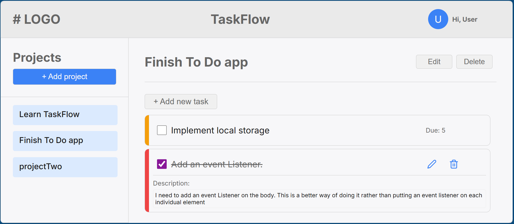
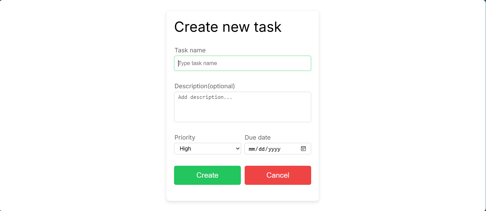

# TaskFlow

TaskFlow is a simple to-do list app. It was build using **JavaScript ES Modules**, **Webpack 5**, **CSS**, and
**feather-icons** to dynamically generate all of the content and component. \
The app stores simple or related tasks under the same project name. \

## **Table of Contents**
1. [Introduction](#)
2. [Features](#)
3. [Project Structure](#)
4. [Installation](#)
5. [Avaliable Scripts](#)
6. [Demo/Visual](#)
7. [LIcense](#)
8. [Author](#)

## 1. **Introduction**

The todo-list app is entirely built using **JavaScript Modules** and DOM manipulation. No static **HTML** all of the contents and components are dynamically generated using **JavaScript**.

This project is ideal for learning: - Webpack setup - ES module
architecture - Component-based UI design - Dynamic page rendering using
JavaScript

## 2. **Features**

### ✔ Modular ES6 JavaScript

Each component is dynamically generated using javaScript

### ✔ Resuable tools and utlities(`tools.js`)

Includes helper functions: - `createElement()`
- `appendChildren()`

### ✔ Local storage

Stores all user data(projects and their corresponding tasks) on the users system/computer

## 3. **Project Structure**

```text
todo-list/
├── src/
│   ├── index.js
│   ├── main.js
│   ├── style.css
│   ├── template.html
│   ├── todoListItem.js
│   └── tools.js
├── README.md
└── package.json
```

## 4. **Installation**

### Clone the repository

```bash
git clone https://github.com/unggie/todo-list.git
cd todo-list
```

### Install the dependencies

```bash
npm install
```

## 5. **Avaliable Scripts**

### Start servers
```bash
npm run dev
```

- Opens a local server 
- Auto rebuilds upon saving

## 6. **Demo/Visual**
[Live demo](https://unggie.github.io/todo-list/)




## 7. **License**

This project is licensed under the **ISC License**.

## 8. **Author**

**Phiri Ungweru**\
phiriungweru@gmail.com\
GitHub: https://github.com/unggie
